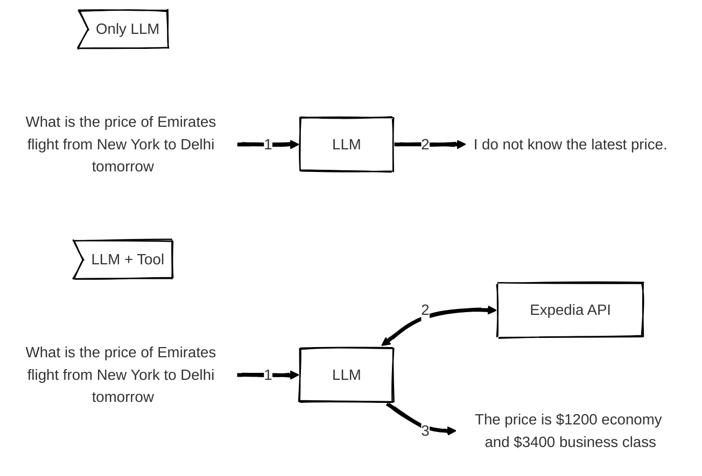

It is a type of AI that creates new content, such as text, images or audio based on patterns learned from existing data.[^1]
+ [c] Knowledge freshness depends on training cutoff.

To overcome this limitation, LLMs can use tools (web search, APIs, code interpreter etc.) to ground their predictions.

# Memory Vs Knowledge
[^2][^3]
**Knowledge**: External reference material (RAG database, company policies) and pre-existing data (training data) that <mark style="background: #ADCCFFA6;">remains uniform across all users. </mark>
+ [*] It provides a fixed ground truth that is <mark style="background: #FFB8EBA6;">available across different chats.</mark>

**Memory**: It is unique to every user/chat.
1. **Context Window (Short term memory)**: It holds a limited amount of tokens that a model uses to track the conversation flow. Once this window is exceeded, earlier parts of the conversation are forgotten.
	+ [!] Memory lasts for the active session only!
2. **Long term memory**: User preferences or history is stored externally as embeddings or structured records and <mark style="background: #FFB8EBA6;">reused across multiple chat sessions.</mark>

# References

[^1]: [Generative AI vs AI agents vs Agentic AI - YouTube](https://www.youtube.com/watch?v=O2gerCxEXvc)

[^2]: [Agent Knowledge vs Memories: Understanding the Difference - DEV Community](https://dev.to/bobur/agent-knowledge-vs-memories-understanding-the-difference-4pgj)

[^3]: [Do Large Language Models have Memory? \| by Edgar Bermudez \| about ai \| Medium](https://medium.com/about-ai/do-large-language-models-have-memory-f5f86405ffd3)
